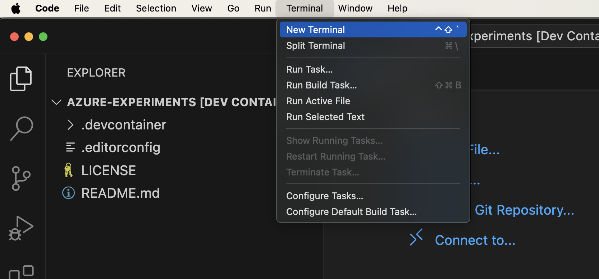

# Azure Experiments

This repo serves as a playground to experiment and learn with code examples using technologies like serverless and OpenAI. We will be using Azure as the cloud provider.

> Disclaimer: This repo is not intended to be used in production. It is for learning purposes only. 

## Getting Started

All samples contain a README.md file with instructions on how to run the sample. The README contains a prerequisite section that lists the tools you need to have installed to run the sample. You can choose to use the Dev Container in VS Code or install the tools locally.

We will us the [AZ CLI](https://docs.microsoft.com/en-us/cli/azure/install-azure-cli?view=azure-cli-latest) to deploy the necessary Azure resource for the samples. Alternatives like [Bicep](https://docs.microsoft.com/en-us/azure/azure-resource-manager/bicep/overview) or [Terraform](https://www.terraform.io/) can also be used.

### Dev Container

If you have the [Remote - Containers](https://marketplace.visualstudio.com/items?itemName=ms-vscode-remote.remote-containers) extension installed in VS Code, you can open the root folder in a container and run the sample. The dev container has all the tools you need to run the sample.

#### Steps to open the root folder in a container

1. Start VS Code and run Dev Containers: Clone Repository in Container Volume... from the Command Palette (F1).

    

1. Enter nickdala/azure-experiments in the input box that appears and press Enter.

    

1. Open a terminal in VS Code

    Open a terminal in VS Code using one of the following methods.

    * From the menu, use the Terminal > New Terminal or View > Terminal menu commands.
    * To create a new terminal, use the Ctrl+Shift+` keyboard shortcut.

    

### Local development without Dev Container

Clone or download this repository. From your shell or command line:

```Shell
git clone https://github.com/nickdala/azure-experiments.git

cd azure-experiments
```

## Samples

1. [Azure Active Directory with Spring Boot - samples/azure-active-directory-spring-boot/](samples/azure-active-directory-spring-boot/README.md)
