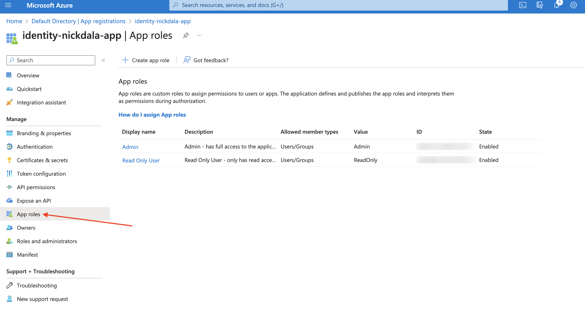
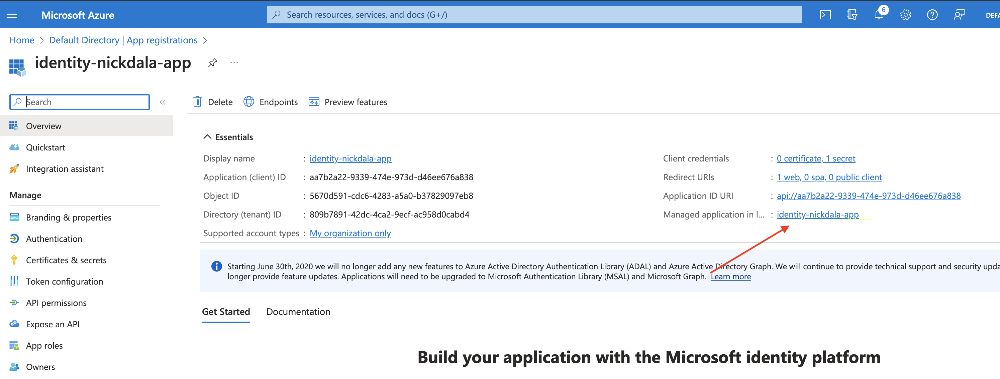
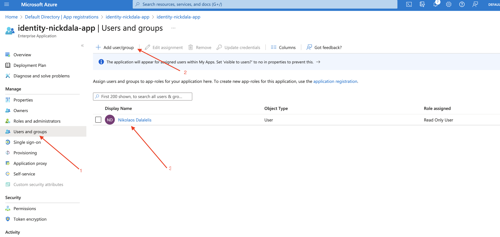

# Azure Active Directory with Spring Boot

This sample contains a Spring Boot application that authenticates users against Azure AD using OAuth 2.0 and OpenID Connect.

## How To Run This Sample

Getting started is simple!  To run this sample you will need is the following:

### Prerequisites

- [Java 17 or later](http://www.oracle.com/technetwork/java/javase/downloads/index.html)
- [Maven](https://maven.apache.org/download.cgi)
- [Azure subscription](https://azure.microsoft.com/en-us/free/)
- [Azure CLI](https://docs.microsoft.com/en-us/cli/azure/install-azure-cli?view=azure-cli-latest)


### 1. Login to Azure

Login to Azure using the Azure CLI.

```shell
az login --scope https://graph.microsoft.com//.default
```

Optional: Set the default subscription. If you have multiple subscriptions, you can list them using `az account list`.

```shell
az account list --output table

az account set --subscription <subscription-id>
```

### 2. Register Application with Azure AD

Choose a unique display name for your Application Registration.

```shell
export AD_DISPLAY_NAME=identity-nickdala-app
```

Create an Application registration with Azure AD and save the output.

```shell
az ad app create \
--display-name $AD_DISPLAY_NAME \
--sign-in-audience AzureADMyOrg \
--web-redirect-uris http://localhost:8080/login/oauth2/code/ \
--app-roles @data/manifest.json \
--enable-id-token-issuance > ad-app.json
```

Detailed information about redirect URIs can be found [here](https://docs.microsoft.com/en-us/azure/active-directory/develop/quickstart-register-app#add-a-redirect-uri).

### 3. Create the client secret

Retrieve the Application ID and reset the client secret:

```shell
AD_APP_ID=$(jq -r '.appId' ad-app.json)

echo $AD_APP_ID

az ad app credential reset --id ${AD_APP_ID} --append > ad-credentials.json
```

### 4. Create a Service Principal

Create a Service Principal for the Application Registration. The Service Principal is used to authenticate the application to Azure AD. The Service Principal defines the permissions that the application has in Azure AD. The Service Principal is also used to authenticate the application to Azure resources.

For more information about Service Principals, see [Application and service principal objects in Azure Active Directory](https://docs.microsoft.com/en-us/azure/active-directory/develop/app-objects-and-service-principals).

```shell
az ad sp create --id ${AD_APP_ID}
```

### 5. Display the Azure AD Variables

```shell
CLIENT_ID=$(cat ad-credentials.json | jq -r '.appId')

CLIENT_SECRET=$(cat ad-credentials.json | jq -r '.password')

TENANT_ID=$(cat ad-credentials.json | jq -r '.tenant')

echo "CLIENT_ID: ${CLIENT_ID}"
echo "CLIENT_SECRET: ${CLIENT_SECRET}"
echo "TENANT_ID: ${TENANT_ID}"
```

### 6. Application ID URI

Update the Application ID URI. The Application ID URI is used to identify the application in Azure AD. The Application ID URI is used to grant permissions to the application.

For more information about Application ID URI, see [Application and service principal objects in Azure Active Directory](https://docs.microsoft.com/en-us/azure/active-directory/develop/app-objects-and-service-principals).

```shell
AD_APP_ID_URI="api://${CLIENT_ID}"

az ad app update --id ${AD_APP_ID} --identifier-uris ${AD_APP_ID_URI}
```

### 7. Assign Current user to Application

Assign the current user to the Application Registration.

```shell
az ad app owner add --id ${AD_APP_ID} --owner-object-id $(az ad signed-in-user show --query id --output tsv)
```

### 8. Give current user access to the application as a Readonly user

Navigate to the Azure Portal and open the Application Registration you created earlier.


Let's take a look at the application roles that we defined earlier in the data/manifest.json file. Click on the `App Roles`. This will open the application roles blade. You should see the `ReadOnly` and `Admin` roles.



Next, click on the `Managed application in local directory` link. This will open the application in the Azure AD portal.



Click on the `Users and groups` tab and add the current user as a member of the application. Assign the `ReadOnly` role to the user.



## Run the application

Update the `application.properties` file with the Azure AD variables. This file is located in the `src/main/resources` directory.

```shell
spring.cloud.azure.active-directory.credential.client-id=${CLIENT_ID}
spring.cloud.azure.active-directory.credential.client-secret=${CLIENT_SECRET}
spring.cloud.azure.active-directory.profile.tenant-id=${TENANT_ID}
```

Run the application.

On Mac/Linux:

```shell
./mvnw spring-boot:run
```

On Windows:

```shell
mvnw.cmd spring-boot:run
```

## Test the application


### Login to the application

Open a browser and navigate to `http://localhost:8080`. You should be redirected to the Azure AD login page.

Login with your your Azure AD credentials, and grant the application access to your account. This will redirect you back to the application's home page.

### Get User Information

Navigate to `http://localhost:8080/whomai`. You should see the user information returned in JSON format.

```json
{
    "name": "Nikolaos Dalalelis",
    "claims": [
        "sub=oUxDZhgz0-hMaKcD3TBkqV44q4U40Z48kwlVlP2ok3c",
        "ver=2.0",
        "roles=[ReadOnly]",
        "name=Nikolaos Dalalelis",
        "exp=2023-10-08T14:58:37Z",
        "iat=2023-10-08T13:53:37Z"
    ],
    "authorities": [
        "APPROLE_ReadOnly"
    ]
}
```

### Navigate to the Read Only Page

Navigate to `http://localhost:8080/api/read-only`. You should see the following message:

```text
Hello ReadOnly User!
```

### Navigate to the Admin Page

Navigate to `http://localhost:8080/api/admin`. You should see a `403 Access Denied` error.

```json
{
"type": "about:blank",
"title": "Internal Server Error",
"status": 500,
"detail": "Access Denied",
"instance": "/api/admin"
}
```

### Logout

Try giving the use the `Admin` role and navigating to the `http://localhost:8080/api/admin` page again. Make sure to logout from the application by navigating to `http://localhost:8080/logout`.

After logging out, try navigating to the `http://localhost:8080/api/admin` page again. You will need to login again.

You should see the following message:

```text
Hello Admin User!
```

## Resources

- [Azure Active Directory Documentation](https://docs.microsoft.com/en-us/azure/active-directory/)
- [Azure Active Directory v2.0 and the OAuth 2.0 implicit grant flow](https://docs.microsoft.com/en-us/azure/active-directory/develop/v2-oauth2-implicit-grant-flow)
- [OAuth 2.0 and OpenID Connect protocols](https://docs.microsoft.com/en-us/azure/active-directory/develop/active-directory-v2-protocols)
- [Application and service principal objects in Azure Active Directory](https://docs.microsoft.com/en-us/azure/active-directory/develop/app-objects-and-service-principals)
- [Spring Boot Starter for Active Directory](https://learn.microsoft.com/en-us/azure/developer/java/spring-framework/spring-boot-starter-for-azure-active-directory-developer-guide?tabs=SpringCloudAzure5x)
