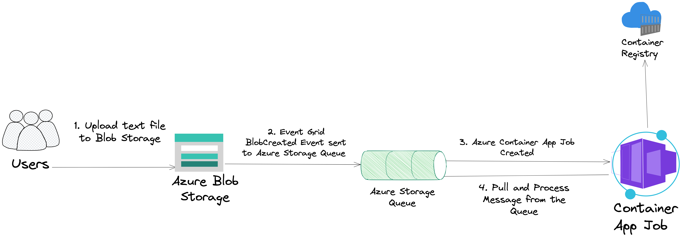

# Azure Blob storage to Azure Event Grid and Azure Container App Job

This pattern demonstrates how to use `Azure Blob Storage` with `Azure Event Grid` subscriptions. Azure Event Grid is an eventing service for the cloud. We'll demonstrate how an event is published to `Azure Storage Queue` once we upload a file to Azure Blob Storage. The event will be pulled and processed by an `Azure Container App Job`. The Container App Job will insert some metadata into an `Azure Cosmos DB for MongoDB API database`.

See the [Blob storage events schema](https://learn.microsoft.com/en-us/azure/event-grid/event-schema-blob-storage?toc=%2Fazure%2Fstorage%2Fblobs%2Ftoc.json&tabs=event-grid-event-schema) article to view the full list of the events that Blob storage supports.

## Architecture



## Prerequisites

- [Azure CLI](https://docs.microsoft.com/en-us/cli/azure/install-azure-cli?view=azure-cli-latest) version 2.53.0 or later.
- [Go](https://golang.org/doc/install) version 1.21.1 or later.

## Run the sample

### 1. Clone the repository

```bash
git clone https://github.com/nickdala/azure-experiments.git
```

### 2. Change directory

```bash
cd azure-experiments/samples/blob-event-grid-container-app
```

### 3. Login to Azure

Login to Azure using the Azure CLI.

```shell
az login
```

Optional: Set the default subscription. If you have multiple subscriptions, you can list them using `az account list`.

```shell
az account list --output table

az account set --subscription <subscription-id>
```

### 4. Verify that the Microsoft.EventGrid is registered.

> You must have the Event Grid provider registered in your subscription.

```bash
az provider list --query "[?contains(namespace,'Microsoft.EventGrid')]" -o table
```

You should see something like the following.

```
Namespace            RegistrationState    RegistrationPolicy
-------------------  -------------------  --------------------
Microsoft.EventGrid  Registered           RegistrationRequired
```

If the *RegistrationState* is not *Registered*, the run the following to register the provider.

```bash
az provider register --namespace Microsoft.EventGrid
```

### 5. Set environment variables

Source the `env.sh` file in the *scripts* directory. You can edit the `env.sh` file to change the default values. Note: Some Azure resources must have globally unique names.


```bash
source ./scripts/env.sh
```

### 6. Create Azure resources

1. Create a resource group.

    ```bash
    az group create \
      --name "$RESOURCE_GROUP" \
      --location "$REGION" \
      --tags system="$TAG"
    ```

1. Create a storage account.

    ```bash
    az storage account create \
      --name "$STORAGE_ACCOUNT_NAME" \
      --resource-group "$RESOURCE_GROUP" \
      --location "$REGION" \
      --tags system="$TAG"
    ```

    Before we can create the storage container and the storage queue, we need the storage account connection string.

1. Get the storage account connection string.

    ```bash
    STORAGE_CONNECTION_STRING=`az storage account show-connection-string --resource-group $RESOURCE_GROUP --name $STORAGE_ACCOUNT_NAME --query connectionString --output tsv`
    ```

1. Create the text storage container.

    ```bash
    az storage container create --name $STORAGE_CONTAINER_NAME_TEXT --account-name $STORAGE_ACCOUNT_NAME --connection-string $STORAGE_CONNECTION_STRING
    ```

1. Create the storage queue.

    ```bash
    az storage queue create --name $QUEUE_NAME --connection-string $STORAGE_CONNECTION_STRING
    ```

1. Create the event subscription.


    First we need the storage account id and the queue endpoint.


    ```bash
    STORAGE_ACCOUNT_ID="/subscriptions/$SUBSCRIPTION_ID/resourceGroups/$RESOURCE_GROUP/providers/Microsoft.Storage/storageAccounts/$STORAGE_ACCOUNT_NAME"

    QUEUE_ENDPOINT="/subscriptions/$SUBSCRIPTION_ID/resourceGroups/$RESOURCE_GROUP/providers/Microsoft.Storage/storageAccounts/$STORAGE_ACCOUNT_NAME/queueservices/default/queues/$QUEUE_NAME"
    ```

    Now we can create the event subscription.

    ```bash
    az eventgrid event-subscription create \
    --name $EVENT_SUBSCRIPTION_NAME \
    --source-resource-id $STORAGE_ACCOUNT_ID \
    --endpoint-type storagequeue \
    --endpoint $QUEUE_ENDPOINT \
    --included-event-types Microsoft.Storage.BlobCreated \
    --subject-ends-with .txt
    ```

### 7. Upload Sample Data to Azure Blob Storage

First we need the storage account key.

```bash
STORAGE_ACCOUNT_KEY=`az storage account keys list --resource-group $RESOURCE_GROUP --account-name $STORAGE_ACCOUNT_NAME --query "[0].value" --output tsv`
```

Verify the storage account key.

```bash
echo $STORAGE_ACCOUNT_KEY
```

Upload the sample text file.

```bash
az storage blob upload \
  --account-name "$STORAGE_ACCOUNT_NAME" \
  --account-key "$STORAGE_ACCOUNT_KEY" \
  --container-name "$STORAGE_CONTAINER_NAME_TEXT" \
  --file "data/sample.txt" \
  --name "sample.txt"
```

### 8. Take a look at the Azure Portal

In the Azure Portal, you will see the storage account, the storage container, the storage queue, and the event subscription. 


Let's take a look at the storage container. You should see the sample.txt file we uploaded. Follow the following steps to view the file.

1. Click on the storage account.
1. Click on the storage container.
    
1. You should see the sample.txt file.
    


 The event subscription publish an event to the storage queue after the file was uploaded. Let's take a look at the `storage queue`.

 1. Navigate to the storage account.
 1. Click on the storage queue.
    

Notice that there is a message in the queue. The message is of the type [BlobCreated](https://learn.microsoft.com/en-us/azure/event-grid/event-schema-blob-storage?tabs=event-grid-event-schema#microsoftstorageblobcreated-event). 


### 9. Azure Container Apps

Next, we will build the app to process the message. This app will be deployed as an `Azure Container App Job`. The source code for the app can be found [here](./main.go). The app will pull the message from the `storage queue` and log the event id and blob url. Below is the code that pulls the message from the queue.

```go
//Dequeue message from the storage queue.
resp, err := queueClient.DequeueMessage(context.TODO(), &azqueue.DequeueMessageOptions{VisibilityTimeout: to.Ptr(int32(30))})

```

#### Deploy the Azure Container App

1. Create the Azure Container Registry

    ```bash
    az acr create \
      --name "$CONTAINER_REGISTRY_NAME" \
      --resource-group "$RESOURCE_GROUP" \
      --location "$REGION" \
      --sku Basic \
      --admin-enabled true \
      --tags system="$TAG"
    ```

#### Build and Deploy the Azure Container App

1. Login to the Azure Container Registry.

    ```bash
    az acr login --name "$CONTAINER_REGISTRY_NAME"
    ```

1. Build the Docker image.

    ```bash
    az acr build \
      --registry "$CONTAINER_REGISTRY_NAME" \
      --image "$CONTAINER_IMAGE_NAME" \
      --file Dockerfile .
    ```

1. Verify the Docker image was pushed to the Azure Container Registry.

    ```bash
    az acr repository list --name $CONTAINER_REGISTRY_NAME --output table
    ```

1. Create the App Environment.

    ```bash
    az containerapp env create \
        --name "$ACA_ENVIRONMENT" \
        --resource-group "$RESOURCE_GROUP" \
        --location "$REGION" \
        --tags system="$TAG"
    ```

1. Create the Azure Container App Job.

    ```bash
    az containerapp job create \
    --name "$ACA_JOB_NAME" \
    --resource-group "$RESOURCE_GROUP" \
    --environment "$ACA_ENVIRONMENT" \
    --trigger-type "Event" \
    --replica-timeout "1800" \
    --replica-retry-limit "1" \
    --replica-completion-count "1" \
    --parallelism "1" \
    --min-executions "0" \
    --max-executions "10" \
    --polling-interval "60" \
    --scale-rule-name "queue" \
    --scale-rule-type "azure-queue" \
    --scale-rule-metadata "accountName=$STORAGE_ACCOUNT_NAME" "queueName=$QUEUE_NAME" "queueLength=1" \
    --scale-rule-auth "connection=connection-string-secret" \
    --image "$CONTAINER_REGISTRY_NAME.azurecr.io/$CONTAINER_IMAGE_NAME" \
    --cpu "0.25" \
    --memory "0.5Gi" \
    --secrets "connection-string-secret=$STORAGE_CONNECTION_STRING" "storage-key=$STORAGE_ACCOUNT_KEY" \
    --registry-server "$CONTAINER_REGISTRY_NAME.azurecr.io" \
    --env-vars "AZURE_STORAGE_QUEUE_NAME=$QUEUE_NAME" "AZURE_STORAGE_CONNECTION_STRING=secretref:connection-string-secret" "AZURE_STORAGE_ACCOUNT_NAME=$STORAGE_ACCOUNT_NAME" "AZURE_STORAGE_ACCOUNT_KEY=secretref:storage-key"
    ```

### 10. Verify the event was processed by the Azure Container App

Let's now take a look at the logs for the Azure Container App Job. The logs will show that the event was processed by the Azure Container App Job. Navigate to the Azure Container App Job in the Azure Portal. Click on the Container App Job.


This will bring you to the Container App Job resource. Here, you can see things like configuration, secrets, and event scaling. We're going to explore the execution history. Click on the `Execution History` tab. You should see the following.


Click on the `Console Logs` link. You should see the following.


### 9. Cleanup

```bash
az group delete --name $RESOURCE_GROUP --yes --no-wait
```

## Resources

- [Azure Container Apps](https://docs.microsoft.com/en-us/azure/container-apps/overview)
- [Jobs in Azure Container Apps](https://learn.microsoft.com/en-us/azure/container-apps/jobs?tabs=azure-cli)
- [event-driven job with Azure Container Apps](https://learn.microsoft.com/en-us/azure/container-apps/tutorial-event-driven-jobs)
- [Azure Blob storage events schema](https://learn.microsoft.com/en-us/azure/event-grid/event-schema-blob-storage?toc=%2Fazure%2Fstorage%2Fblobs%2Ftoc.json&tabs=event-grid-event-schema)
