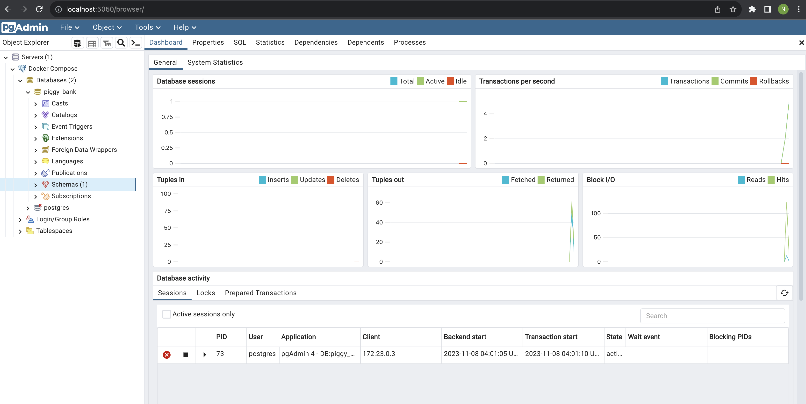

# Piggy Bank

This project uses [Hilla](https://hilla.dev) to create a simple banking application.  It uses OpenAI's GPT-3 to generate text for the user interface.

## Setup

### 1. Clone the repository and change directory

```bash
git clone https://github.com/nickdala/azure-experiments.git

cd azure-experiments/samples/piggy-bank-openai-app
```

### 2. Start PostgreSQL and pgAdmin

Run the following command outside of the dev container. You will hit this [bug](https://github.com/microsoft/vscode-remote-release/issues/5808) if you try to run the following command from within the dev container.

```bash
docker compose -f docker/compose.yaml up
```

Navigate to the [pgAdmin](https://www.pgadmin.org/) UI at [http://localhost:5050](http://localhost:5050). You should see something like the following:



You can stop the containers with the following command:

```bash
docker compose -f ./docker/compose.yaml down
```

Optional: Stop the containers removing the volumes.  This is handy if you want to start with a clean slate.

```bash
docker compose -f ./docker/compose.yaml down -v
```

### 3. Build and Run the application

The project is a standard Maven project. To run it from the command line,
type `mvnw` (Windows), or `./mvnw` (Mac & Linux).

If you're running inside of a dev container, make sure to set the property spring.datasource.url inside [application.properties](./src/main/resources/application.properties) file appropriately to use host.docker.internal to connect to the PostgreSQL container.

```bash
spring.datasource.url=jdbc:postgresql://host.docker.internal:54321/piggy_bank
```

Now, you can run the app by executing the following command.

```bash
./mvnw
```

Then open [http://localhost:8080](http://localhost:8080) in your browser.

## Deploying to Production

To create a production build, call `mvnw clean package -Pproduction` (Windows),
or `./mvnw clean package -Pproduction` (Mac & Linux).

```bash
./mvnw clean package -Pproduction
```

This will build a JAR file with all the dependencies and front-end resources,
ready to be deployed. The file can be found in the `target` folder after the build completes.

Once the JAR file is built, you can run it using
`java -jar target/myapp-1.0-SNAPSHOT.jar` (NOTE, replace
`myapp-1.0-SNAPSHOT.jar` with the name of your jar).


## Project structure

<table style="width:100%; text-align: left;">
  <tr><th>Directory</th><th>Description</th></tr>
  <tr><td><code>frontend/</code></td><td>Client-side source directory</td></tr>
  <tr><td>&nbsp;&nbsp;&nbsp;&nbsp;<code>index.html</code></td><td>HTML template</td></tr>
  <tr><td>&nbsp;&nbsp;&nbsp;&nbsp;<code>index.ts</code></td><td>Frontend 
entrypoint, bootstraps a React application</td></tr>
  <tr><td>&nbsp;&nbsp;&nbsp;&nbsp;<code>routes.tsx</code></td><td>React Router routes definition</td></tr>
  <tr><td>&nbsp;&nbsp;&nbsp;&nbsp;<code>MainLayout.tsx</code></td><td>Main 
layout component, contains the navigation menu, uses <a href="https://hilla.dev/docs/react/components/app-layout">
App Layout</a></td></tr>
  <tr><td>&nbsp;&nbsp;&nbsp;&nbsp;<code>views/</code></td><td>UI view 
components</td></tr>
  <tr><td>&nbsp;&nbsp;&nbsp;&nbsp;<code>themes/</code></td><td>Custom  
CSS styles</td></tr>
  <tr><td><code>src/main/java/&lt;groupId&gt;/</code></td><td>Server-side 
source directory, contains the server-side Java views</td></tr>
  <tr><td>&nbsp;&nbsp;&nbsp;&nbsp;<code>Application.java</code></td><td>Server entry-point</td></tr>
</table>

## Useful links

- Read the documentation at [hilla.dev/docs](https://hilla.dev/docs/).
- Ask questions on [Stack Overflow](https://stackoverflow.com/questions/tagged/hilla) or join our [Discord channel](https://discord.gg/MYFq5RTbBn).
- Report issues, create pull requests in [GitHub](https://github.com/vaadin/hilla).
